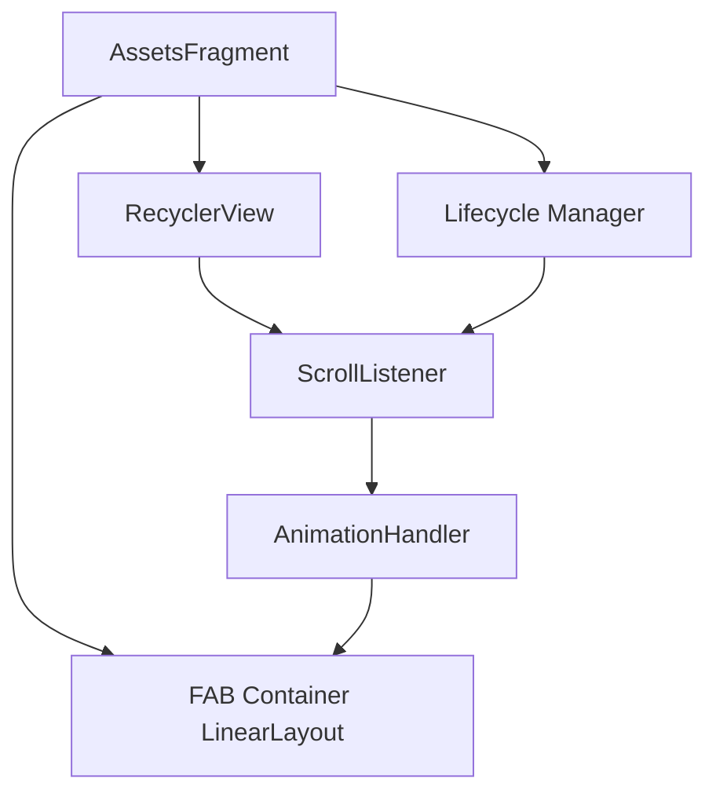

# 技术设计文档 - 资产模块滚动隐藏按钮

## 概述

本功能为 AssetsFragment 的 RecyclerView 添加滚动监听机制，根据用户的滚动方向自动显示或隐藏浮动按钮容器（包含添加资产按钮和转移资产按钮）。通过平移动画实现流畅的视觉效果，提升用户在浏览长列表时的体验。

### 设计目标

1. **非侵入性**: 不改变现有的 Fragment 生命周期和数据流
2. **性能优化**: 避免频繁触发动画，使用防抖机制
3. **无障碍兼容**: 保持按钮的可访问性属性不变
4. **状态管理**: 正确处理 Fragment 切换和生命周期事件

## 架构

### 组件关系图



### 核心组件

1. **ScrollListener**: 继承 `RecyclerView.OnScrollListener`，负责捕获滚动事件
2. **AnimationHandler**: 封装动画逻辑，管理按钮的显示/隐藏状态
3. **FAB Container**: 现有的 LinearLayout，包含两个 FloatingActionButton
4. **State Manager**: 跟踪按钮当前的显示状态，避免重复动画

## 组件和接口

### 1. ScrollListener 类

```java
private class FabScrollListener extends RecyclerView.OnScrollListener {
    private static final int SCROLL_THRESHOLD = 5; // 像素阈值
    
    @Override
    public void onScrolled(@NonNull RecyclerView recyclerView, int dx, int dy) {
        super.onScrolled(recyclerView, dx, dy);
        
        // 忽略微小滚动
        if (Math.abs(dy) < SCROLL_THRESHOLD) {
            return;
        }
        
        // 向上滚动（dy > 0）隐藏按钮
        if (dy > 0 && isFabVisible) {
            hideFab();
        }
        // 向下滚动（dy < 0）显示按钮
        else if (dy < 0 && !isFabVisible) {
            showFab();
        }
    }
}
```

**职责**:
- 监听 RecyclerView 的滚动事件
- 计算滚动方向和距离
- 根据阈值过滤微小滚动
- 调用 AnimationHandler 的显示/隐藏方法

**关键参数**:
- `SCROLL_THRESHOLD`: 滚动阈值（5 像素），防止抖动触发动画

### 2. AnimationHandler 方法

```java
private boolean isFabVisible = true; // 按钮当前可见状态
private LinearLayout fabContainer; // FAB 容器引用

private void hideFab() {
    if (!isFabVisible) return; // 防止重复执行
    
    isFabVisible = false;
    fabContainer.animate()
        .translationY(fabContainer.getHeight() + getResources().getDimensionPixelSize(R.dimen.fab_margin))
        .setInterpolator(new AccelerateInterpolator())
        .setDuration(200)
        .start();
}

private void showFab() {
    if (isFabVisible) return; // 防止重复执行
    
    isFabVisible = true;
    fabContainer.animate()
        .translationY(0)
        .setInterpolator(new DecelerateInterpolator())
        .setDuration(200)
        .start();
}
```

**职责**:
- 管理按钮的显示/隐藏状态
- 执行平移动画
- 防止重复动画执行

**动画参数**:
- **隐藏动画**: 
  - 平移距离: `容器高度 + 底部边距`
  - 插值器: `AccelerateInterpolator`（加速）
  - 持续时间: 200ms
- **显示动画**:
  - 平移距离: 0（回到原位）
  - 插值器: `DecelerateInterpolator`（减速）
  - 持续时间: 200ms

### 3. 生命周期管理

```java
private FabScrollListener fabScrollListener;

@Override
public View onCreateView(@NonNull LayoutInflater inflater, @Nullable ViewGroup container, 
                         @Nullable Bundle savedInstanceState) {
    View view = inflater.inflate(R.layout.fragment_assets, container, false);
    
    // 初始化组件
    fabContainer = view.findViewById(R.id.fab_container); // 需要给 LinearLayout 添加 ID
    rvAssets = view.findViewById(R.id.rv_assets_list);
    
    // 创建并添加滚动监听器
    fabScrollListener = new FabScrollListener();
    rvAssets.addOnScrollListener(fabScrollListener);
    
    // 其他初始化代码...
    return view;
}

@Override
public void onResume() {
    super.onResume();
    // 恢复按钮显示状态
    isFabVisible = true;
    fabContainer.setTranslationY(0);
}

@Override
public void onDestroyView() {
    super.onDestroyView();
    // 移除监听器，防止内存泄漏
    if (rvAssets != null && fabScrollListener != null) {
        rvAssets.removeOnScrollListener(fabScrollListener);
    }
    fabScrollListener = null;
    fabContainer = null;
}
```

**职责**:
- 在 `onCreateView` 中初始化监听器
- 在 `onResume` 中重置按钮状态
- 在 `onDestroyView` 中清理资源

## 数据模型

### 状态变量

| 变量名 | 类型 | 初始值 | 说明 |
|--------|------|--------|------|
| `isFabVisible` | boolean | true | 按钮当前是否可见 |
| `fabContainer` | LinearLayout | null | FAB 容器的引用 |
| `fabScrollListener` | FabScrollListener | null | 滚动监听器实例 |

### 常量定义

| 常量名 | 值 | 说明 |
|--------|-----|------|
| `SCROLL_THRESHOLD` | 5 | 滚动阈值（像素） |
| `ANIMATION_DURATION` | 200 | 动画持续时间（毫秒） |

## 错误处理

### 1. 空指针保护

```java
private void hideFab() {
    if (fabContainer == null || !isFabVisible) return;
    // 动画逻辑...
}

private void showFab() {
    if (fabContainer == null || isFabVisible) return;
    // 动画逻辑...
}
```

### 2. 列表内容不足处理

当 RecyclerView 的内容不足以滚动时，滚动监听器不会触发，按钮保持默认显示状态。无需额外处理。

### 3. 快速滚动处理

Android 的 `ViewPropertyAnimator` 会自动取消未完成的动画并开始新动画，无需手动处理。

### 4. 内存泄漏防护

在 `onDestroyView` 中移除监听器并清空引用：

```java
@Override
public void onDestroyView() {
    super.onDestroyView();
    if (rvAssets != null && fabScrollListener != null) {
        rvAssets.removeOnScrollListener(fabScrollListener);
    }
    fabScrollListener = null;
    fabContainer = null;
}
```

## 测试策略

### 单元测试

由于本功能主要涉及 UI 交互和动画，单元测试的价值有限。建议使用以下测试方法：

1. **滚动阈值测试**
   - 验证小于 5 像素的滚动不触发动画
   - 验证大于 5 像素的滚动触发动画

2. **状态管理测试**
   - 验证 `isFabVisible` 状态正确更新
   - 验证重复调用 `hideFab()` 不会重复执行动画

### 集成测试

使用 Espresso 进行 UI 测试：

```java
@Test
public void testFabHidesOnScrollUp() {
    // 1. 启动 AssetsFragment
    // 2. 向上滚动 RecyclerView
    onView(withId(R.id.rv_assets_list))
        .perform(swipeUp());
    
    // 3. 等待动画完成
    Thread.sleep(300);
    
    // 4. 验证 FAB 容器的 translationY > 0
    onView(withId(R.id.fab_container))
        .check(matches(hasTranslationY(greaterThan(0f))));
}

@Test
public void testFabShowsOnScrollDown() {
    // 1. 先向上滚动隐藏按钮
    onView(withId(R.id.rv_assets_list))
        .perform(swipeUp());
    Thread.sleep(300);
    
    // 2. 向下滚动
    onView(withId(R.id.rv_assets_list))
        .perform(swipeDown());
    Thread.sleep(300);
    
    // 3. 验证 FAB 容器的 translationY == 0
    onView(withId(R.id.fab_container))
        .check(matches(hasTranslationY(0f)));
}
```

### 手动测试场景

1. **基本滚动测试**
   - 向上滚动列表，验证按钮平滑隐藏
   - 向下滚动列表，验证按钮平滑显示

2. **边界测试**
   - 列表项少于屏幕高度时，按钮保持显示
   - 滚动到列表顶部/底部时，按钮行为正常

3. **生命周期测试**
   - 切换到其他 Fragment 再返回，按钮恢复显示状态
   - 切换资产类型（资产/负债/借出），按钮状态保持

4. **无障碍测试**
   - 启用 TalkBack，验证按钮仍可通过触摸探索访问
   - 验证按钮的 contentDescription 正常工作

5. **性能测试**
   - 快速连续滚动，验证动画流畅无卡顿
   - 长时间使用，验证无内存泄漏

## 实现注意事项

### 1. 布局修改

需要给 FAB 容器添加 ID：

```xml
<LinearLayout
    android:id="@+id/fab_container"
    android:layout_width="wrap_content"
    android:layout_height="wrap_content"
    android:layout_gravity="bottom|end"
    android:orientation="vertical"
    android:layout_margin="20dp"
    android:gravity="center_horizontal">
    
    <!-- 现有的两个 FAB -->
</LinearLayout>
```

### 2. 无障碍兼容性

**不要**修改以下属性：
- `android:importantForAccessibility`
- `android:contentDescription`
- `android:visibility`（使用 translationY 而非 visibility）

### 3. 动画性能优化

使用 `ViewPropertyAnimator` 而非 `ObjectAnimator`，因为：
- 更高效（直接操作 View 属性）
- 自动处理动画冲突
- 代码更简洁

### 4. 状态恢复

在 `onResume` 中重置按钮状态，确保用户从其他 Fragment 返回时看到按钮：

```java
@Override
public void onResume() {
    super.onResume();
    isFabVisible = true;
    if (fabContainer != null) {
        fabContainer.setTranslationY(0);
    }
}
```

### 5. 主题兼容性

现有代码已处理自定义背景主题的透明度，滚动隐藏功能不影响主题系统。

## 依赖关系

### 现有依赖
- `androidx.recyclerview:recyclerview` (已有)
- `com.google.android.material:material` (已有)

### 无需新增依赖

## 性能考虑

1. **滚动性能**: 
   - 使用阈值过滤微小滚动，减少动画触发频率
   - `ViewPropertyAnimator` 使用硬件加速

2. **内存管理**:
   - 在 `onDestroyView` 中清理监听器
   - 使用成员变量而非匿名内部类，避免隐式引用

3. **动画流畅度**:
   - 200ms 的动画时长经过优化，既不会太快（生硬）也不会太慢（拖沓）
   - 使用插值器使动画更自然

## 向后兼容性

- 最低 API 级别: 21 (Android 5.0)
- 所有使用的 API 均在 API 21+ 可用
- 无需添加 `@RequiresApi` 注解

## 安全性考虑

本功能仅涉及 UI 交互，无安全风险。

## 未来扩展

1. **可配置性**: 可在设置中添加开关，允许用户禁用此功能
2. **自定义阈值**: 允许用户调整滚动灵敏度
3. **其他 Fragment**: 可将此模式应用到其他包含 FAB 的 Fragment

## 参考资料

- [Material Design - Floating Action Button](https://material.io/components/buttons-floating-action-button)
- [Android RecyclerView.OnScrollListener](https://developer.android.com/reference/androidx/recyclerview/widget/RecyclerView.OnScrollListener)
- [ViewPropertyAnimator](https://developer.android.com/reference/android/view/ViewPropertyAnimator)
